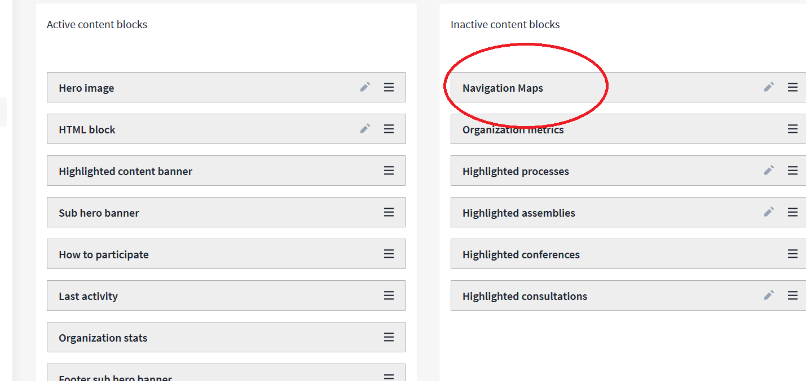
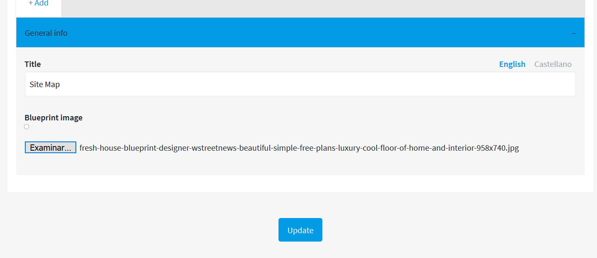
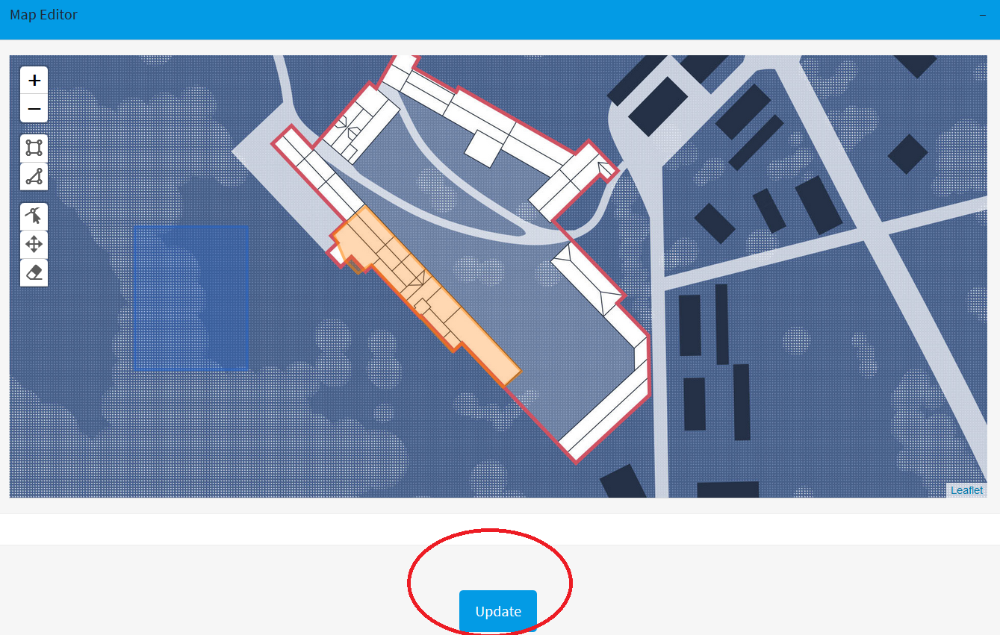
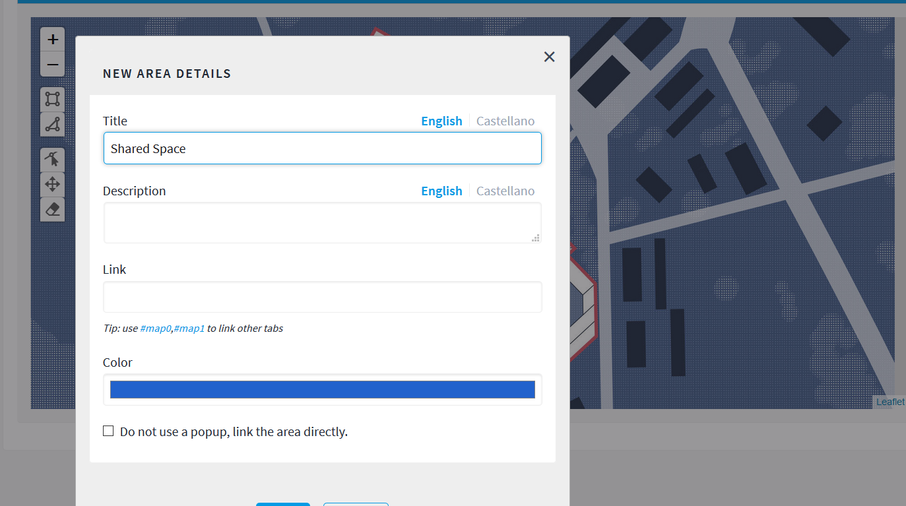

# Using Navigation Maps 
 
Platoniq has come out with a new feature for the Decidim platform, Navigation Maps! This feature allows the administrator to post layouts that display multiple blueprints or maps and highlight sections in which a team or community is working. Participants can then click on these highlighted sections to access processes/assemblies/consultations attached to the space.

This feature is currently available to put on your homepage. Let's check out how!

First you will need to click on settings at the left hand side of your dashboard and then click homepage. 

Then you will see Navigation Maps

You will need do drag 'Navigation Maps' to 'Active Content Blocks'

Then click on the pencil icon within the blocks to get started editing

To upload a layout, blueprint, or map click '+ADD'

Then you will need to give the section a title and upload your image where it says 'blueprint image'. Then click update.

When you click 'Map Editor' an image of your blueprint should show up with tools on the left hand side for you to select and area of the layout

Use the square icon to highlight rectangular or square spaces and triangular icon to create new forms or shapes, the icon with the arrow lets you adjust the shape

When you've highlighted the area in which you will be working, click update:

Click the area you've highlighted on your layout:

A new space to edit the layout should appear. 

Title the layout, give a short description that fits your project, and link to the process/assembly/consultation where you and your team or community will decide what happens to the space. Don't forget to save your changes.

Now on your homepage this is how the layout should appear:

The 'Take Part' button will send the participant to the link that you've added.
